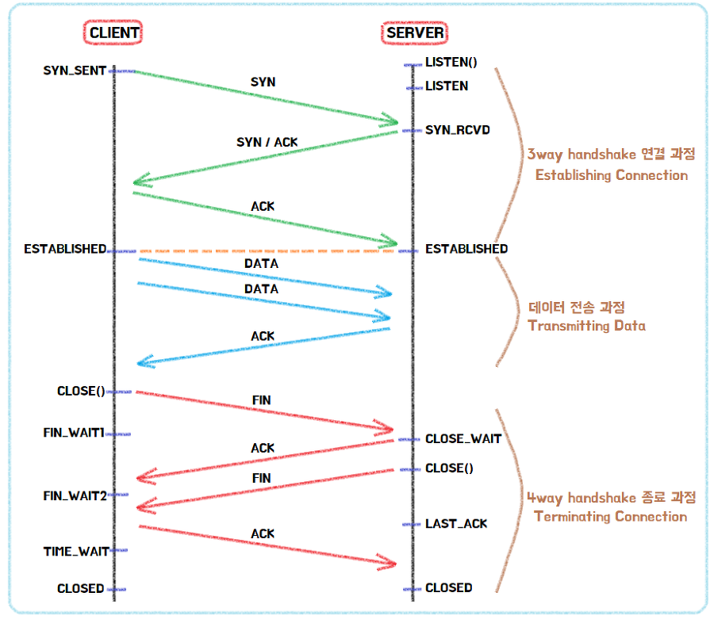

# TCP / UDP

## TCP (Transmission Control Protocol)

데이터가 반드시 전달되는 것을 보장하는 프로토콜입니다.

- 연결지향 (Connection-oriented) 으로 통신을 하기 전 연결이 이루어져야 합니다.
- 높은 신뢰성 (Reliability) 과 순서 (In-order delivery) 를 보장합니다.
  - 흐름 제어(Flow control) 를 통해 송신자의 데이터 양을 조절합니다.
  - 혼잡 제어(Congestion control) 를 통해 네트워크 상황을 감지하고 송신자의 데이터 양을 조절합니다.
  - 에러 감지(Error detection) 를 통해 잘못 전송되었을 경우 재전송합니다.
- 전 이중(Full duplex) 방식 으로 두 호스트 모두 송신자와 수신자가 될 수 있습니다.
- 바이트 스트림(Byte stream) 을 사용하여 데이터를 연속적인 바이트로 간주하고, 세그먼트(Segment) 라는 단위의 패킷으로 쪼개서 보냅니다.
- HTTP, FTP, SMTP, TELNET 등에서 사용됩니다.

## UDP (User Datagram Protocol)

TCP와 달리 데이터의 신뢰성을 보장하지 않는 프로토콜입니다.

- 비연결형 (Connection-less) 으로 연결 설정, 해제 과정이 없습니다.
- 신뢰성이 없고 전송되는 데이터의 순서를 보장하지 않습니다.
  - 흐름 제어, 혼잡 제어가 없습니다.
  - 에러 감지는 헤더의 체크섬 (Checksum) 에 의존합니다.
- 패킷의 단위가 데이터그램 (Datagram) 으로 경계가 분명하여 수신자는 송신자가 보낸 그대로의 크기로 받습니다.
- 서버와 클라이언트는 유니캐스트 (1:1), 브로드캐스트 (1:N), 멀티캐스트 (1:M)가 가능합니다. (N은 전체, M은 일부)
- TCP에 비해서 하는 작업들이 굉장히 적기 때문에 속도가 빠흡니다.
- DNS, DHCP, 비디오/오디오 스트리밍 등에 사용됩니다.

## 3 Way-Handshake & 4 Way-Handshake

### 3 Way-Handshake

1. 클라이언트는 서버에 접속을 요청하는 SYN 을 보냅니다.
이때 클라이언트는 SYN 을 보내고 SYN/ACK 응답을 기다리는 SYN_SENT 상태가 됩니다.
2. 서버는 SYN 요청을 받고 클라이언트에게 요청을 수락한다는 ACK 와 SYN 을 발송하고 클라이언트가 다시 ACK 으로 응답하기를 기다립니다.
이때 서버는 SYN_RECEIVED 상태가 됩니다.
3. 클라이언트는 서버에게 ACK 을 보내고 이후로부터는 연결이 이루어지고 데이터를 전송합니다. 이때의 상태가 ESTABLISHED 입니다.

### 4 Way-Handshake

1. 클라이언트가 연결을 종료하겠다는 FIN 을 전송합니다.
2. 서버는 일단 확인했다는 ACK 을 보내고, 자신의 통신이 끝날때까지 기다리는데 이 상태가 TIME_WAIT 입니다.
3. 서버가 통신이 끝났으면 연결이 종료되었다고 클라이언트에게 FIN 을 전송합니다.
4. 클라이언트는 확인했다는 ACK 을 전송합니다.
